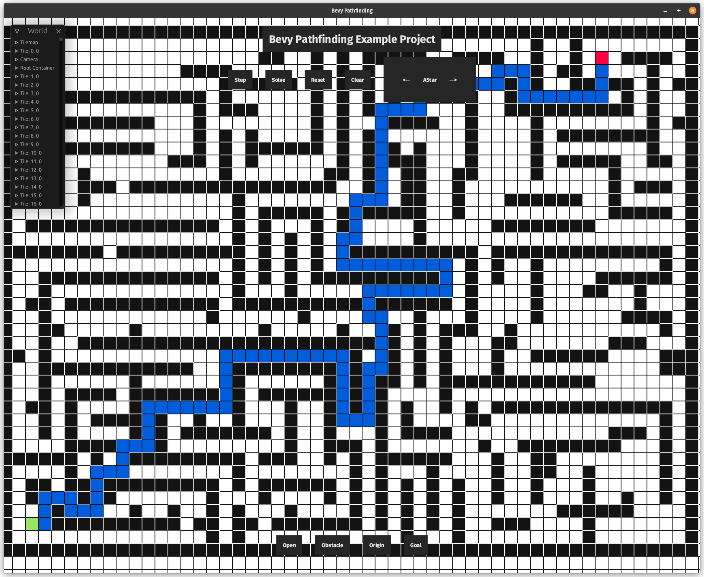

# Bevy Pathfinding

This is a prototype of using the Rust [pathfinding](https://crates.io/crates/pathfinding) crate with
the [Bevy game engine](https://crates.io/crates/bevy).

# Tooling

## clippy

A collection of lints to catch common mistakes and improve your Rust code.

To see suggestions: `cargo clippy`

To automatically apply suggestions: `cargo clippy --fix`

1. https://github.com/rust-lang/rust-clippy

## rustfmt

A tool for formatting Rust code according to style guidelines.

1. https://github.com/rust-lang/rustfmt
2. https://github.com/rust-lang/rustfmt/blob/master/intellij.md (For use with CLion's Rust Plugin)

# Dependencies

See `cargo.toml` for details.

## bevy

Bevy is a refreshingly simple data-driven game engine built in Rust. It is free and open-source forever!

1. https://bevyengine.org/
2. https://bevyengine.org/learn/
3. https://github.com/bevyengine/bevy
4. https://crates.io/crates/bevy

## bevy_ecs_tilemap

A tilemap rendering plugin for bevy. It is more ECS friendly as it makes tiles entities.

1. https://github.com/StarArawn/bevy_ecs_tilemap
2. https://github.com/StarArawn/bevy_ecs_tilemap/tree/main/examples
3. https://docs.rs/bevy_ecs_tilemap/latest/bevy_ecs_tilemap/
4. https://crates.io/crates/bevy_ecs_tilemap

## bevy-inspector-egui

This crate provides a debug interface using egui where you can visually edit the values of your components live.

1. https://github.com/jakobhellermann/bevy-inspector-egui
2. https://crates.io/crates/bevy-inspector-egui

## bevy_rapier2d

2D physics plugin for Bevy.

1. https://rapier.rs/
2. https://rapier.rs/docs/user_guides/bevy_plugin/getting_started_bevy
3. https://github.com/dimforge/bevy_rapier
4. https://crates.io/crates/bevy_rapier2d

## pathfinding

Path finding library for Rust

1. https://rfc1149.net/devel/pathfinding.html
2. https://docs.rs/pathfinding/3.0.14/pathfinding/
3. https://github.com/samueltardieu/pathfinding
4. https://crates.io/crates/pathfinding